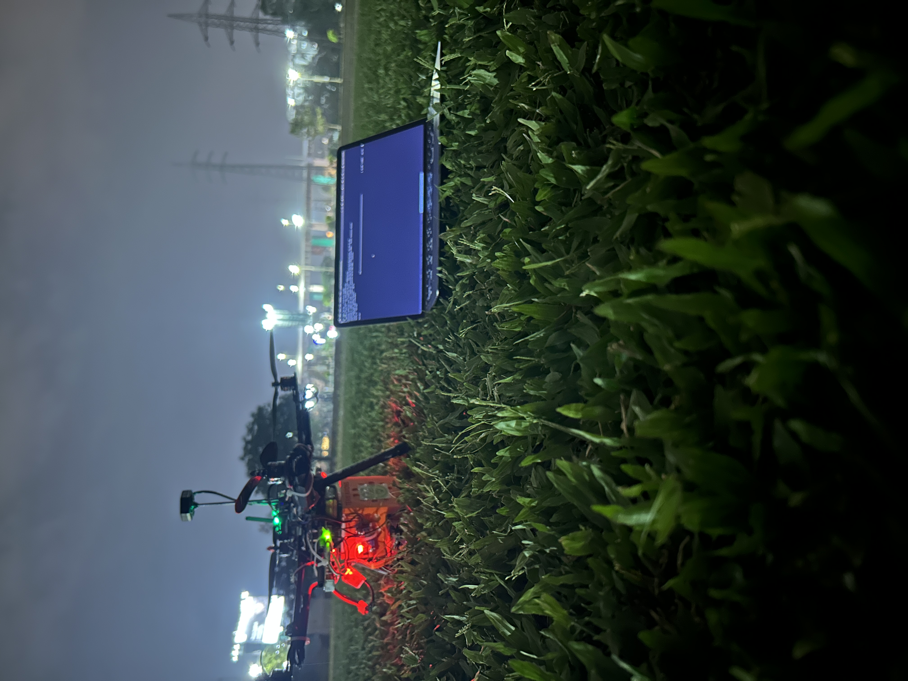

## The Build-Up to ADDC

Our journey to the **Autonomous Drone Delivery Challenge (ADDC)** was nothing short of exhilarating. As members of **Avions**, our college’s aerospace and drone engineering club, we knew this was the ultimate platform to push our limits. Months before the event, our team of ten—each with a mix of hardware, software, and flight dynamics expertise—came together with one mission: to design a drone that could autonomously deliver a payload and return.

## Defining the Mission

The ADDC challenge was to simulate a real-world logistics problem. Our drone had to take off from Point A, fly to a GPS-specified drop zone nearly 500 meters away, deliver a package precisely, and return—*without any manual intervention*. We were also tasked with live data telemetry, map integration, and obstacle avoidance, all under strict time and weight constraints.

Our team divided the work strategically. I led the **autonomous navigation and communication system**, integrating a **Pixhawk flight controller** with a **Raspberry Pi**. We built a secure data pipeline to stream flight logs and coordinates to our ground station in real time. Others focused on structural design, PID tuning, power management, and testing redundancy systems for safety.

## The Trials and Errors

We faced many hurdles. During initial testing, we struggled with GPS drift, which threw our landing coordinates off by 8–10 meters. Our Raspberry Pi kept losing sync with Pixhawk over MAVLink, causing mid-flight stalls. One major breakthrough was isolating the noise from the ESCs (Electronic Speed Controllers) using ferrite rings and proper grounding—a small fix that stabilized our system tremendously.

Wind conditions during outdoor tests were another challenge. With the drone weighing just under 2kg, even a 15km/h crosswind affected the drop accuracy. We solved this using a simple but effective strategy—real-time wind compensation using IMU data combined with predicted drift values from test flights.

## The Day of the Competition

By the time competition day arrived, we had performed 42 test flights—each logged, documented, and improved upon. Our drone lifted off smoothly, adjusted in-air to real wind conditions, and reached the drop point with only 1.3 meters deviation. The package was released using a custom-designed servo latch triggered by GPS proximity.

Our return journey was even more thrilling—navigating an unexpected signal interference zone. But thanks to onboard fallback code and last-minute tuning, our drone landed within the home zone with 95% battery efficiency.

## Reflecting on Team Spirit and Growth

What truly made ADDC special was the way we came together as a team. Late-night debugging sessions, soldering under tube lights, and spontaneous code reviews in the cafeteria all built a rhythm. Every challenge taught us resilience, technical know-how, and how to think like engineers.

Being part of this competition has been one of the most defining experiences in my college journey. Not only did it test our drone—it tested us. And we soared.

> _"Great things are done by a series of small things brought together."_ — Vincent Van Gogh

